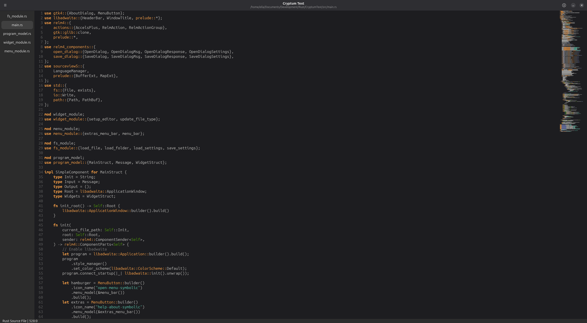

# Cryptum Text

Cryptum Text is a GTK based text/code editor written in Rust and powered by GTK-RS, Relm4, Sourceview5, and Libadwaita.

(Above: Cryptum Text with it's own source code, as is tradition.)

# Features
- Syntax Highlighting
- A Mini-Map
- A Status Bar

## In Progress
- File List
- Saving Settings Between Restarts

## Potential Future Features (Not Confirmed to be Implemented)
- Autocompletion
- File Tree
- Git Intergration
- Mini-Map Pane Highlight
- Confirmation Dialog(s)

# Extra Notes
- The editor widget specifically cannot auto adjust to the system theme, however you can toggle the theme manually and it will persist across restarts (provided "editor_theme" option in the settings file hasn't been changed)
- While the program might run on Windows or MacOS, I haven't tested this myself.
- The ability to toggle showing hidden files is only available on UNIX systems, due to complications with detecting hidden files on Windows
- Folders will have have a / character at the end of them in the file list to differentiate them from files

