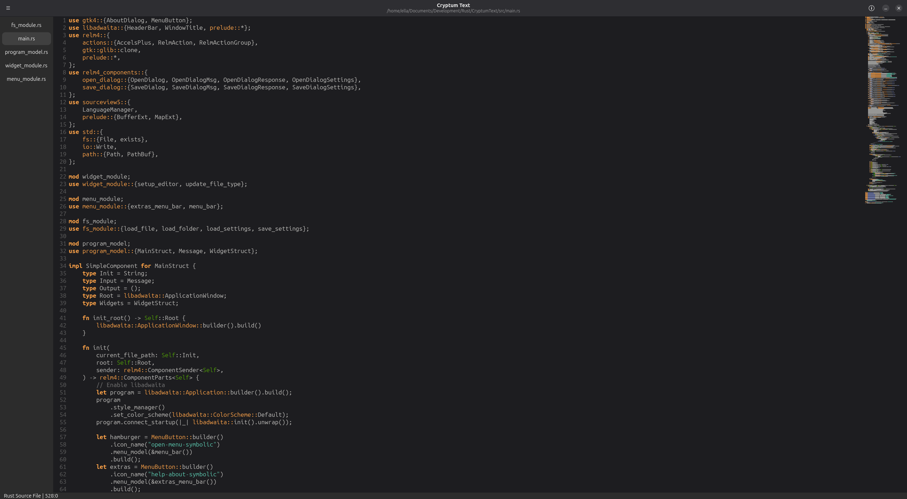

# Cryptum Text

Cryptum Text is a GTK based text/code editor written in Rust and powered by Relm4 and sourceview5.

(Above: Cryptum Text with it's own source code, as is tradition.)

## Features
- Syntax Highlighting
- A Mini-Map
- A Status Bar

# In Progress
- File List

## Potential Future Features (Not Confirmed to be Implemented)
- Saving Settings Between Restarts
- Autocompletion
- File Tree
- Git Intergration
- Mini-Map Pane Highlight
